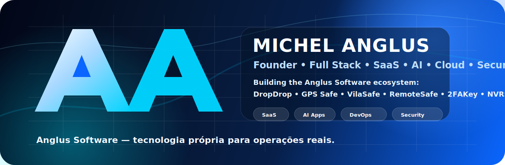
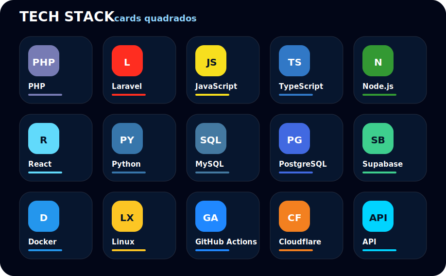

<p align="center">
  
</p>

<h1 align="center">Michel Anglus</h1>

<p align="center">
  <strong>Founder da Anglus Software • Full Stack Builder • SaaS • IA • Cloud • Segurança • E-commerce • Rastreamento</strong>
</p>

<p align="center">
  <a href="https://anglus.com.br">
    
  </a>
  <a href="mailto:michel@anglus.com.br">
    
  </a>
  <a href="https://github.com/michel-anglus">
    
  </a>
  
</p>

---

## 🧠 Sobre mim

Sou o **Michel**, fundador da **Anglus Software**, criando um ecossistema próprio de produtos digitais com foco em **SaaS, automação, inteligência artificial, rastreamento, segurança, infraestrutura e e-commerce**.

Eu gosto de construir sistemas de ponta a ponta: da ideia ao produto, do backend à infraestrutura, da automação à operação real.

> **Minha linha de trabalho:** criar tecnologia própria, escalável e útil para empresas que precisam operar de verdade.

---

## 🏢 Ecossistema Anglus Software

<table>
  <tr>
    <td width="180"><strong>DropDrop</strong></td>
    <td>Plataforma brasileira de dropshipping nacional para vender sem estoque.</td>
  </tr>
  <tr>
    <td><strong>GPS Safe</strong></td>
    <td>Rastreamento, telemetria, monitoramento e alertas para operações em campo.</td>
  </tr>
  <tr>
    <td><strong>VilaSafe</strong></td>
    <td>Tecnologia para condomínios, moradores, portaria e segurança residencial.</td>
  </tr>
  <tr>
    <td><strong>RemoteSafe</strong></td>
    <td>Acesso remoto seguro, suporte técnico e infraestrutura própria.</td>
  </tr>
  <tr>
    <td><strong>2FAKey</strong></td>
    <td>Hardware de autenticação, segurança digital e validação por dispositivo físico.</td>
  </tr>
  <tr>
    <td><strong>NVRSafe</strong></td>
    <td>Monitoramento, câmeras, gravação, NVR e gestão inteligente de imagens.</td>
  </tr>
</table>

---

## ⚡ Áreas fortes

```txt
SaaS e plataformas web       ████████████████████  100%
E-commerce e marketplaces    ████████████████████  100%
Rastreamento e telemetria    ███████████████████   95%
IA e automação               ██████████████████    90%
Infraestrutura Linux/Cloud   ██████████████████    90%
Segurança e autenticação     █████████████████     85%
```

---

## 🧩 Linguagens, frameworks e ferramentas

<p align="center">
  
</p>

<p align="center">
  
</p>

---

## 🚀 O que eu construo

- Plataformas SaaS completas
- Sistemas de pedidos, pagamentos e assinaturas
- Dashboards administrativos e operacionais
- Integrações com APIs externas
- Automações com IA
- Aplicativos web e mobile
- Sistemas de rastreamento e telemetria
- Monitoramento, status page e alertas
- Infraestrutura Linux, Docker, VPS e Cloudflare
- Soluções para marketplaces, logística, segurança e atendimento

---

## 📊 Estatísticas GitHub

<p align="center">
  
  
</p>

<p align="center">
  
</p>

<p align="center">
  
</p>

<p align="center">
  
</p>

---

## 🐍 Contribution Snake

<p align="center">
  
</p>

---

## 🎯 Visão

Construir um ecossistema de produtos próprios, conectando **software, automação, inteligência artificial, infraestrutura e hardware** para resolver problemas reais de empresas brasileiras.

---

## 🌐 Contato

<p align="center">
  <a href="https://anglus.com.br">
    
  </a>
  <a href="mailto:michel@anglus.com.br">
    
  </a>
</p>

<p align="center">
  <strong>Michel Anglus • Anglus Software</strong><br/>
  Tecnologia própria para operações reais.
</p>
