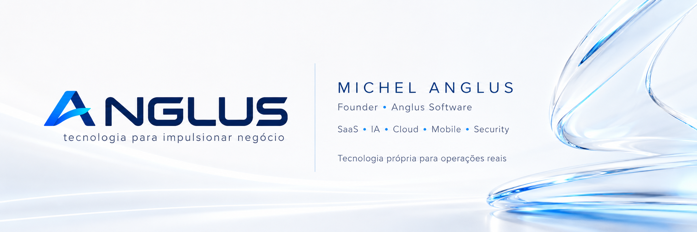
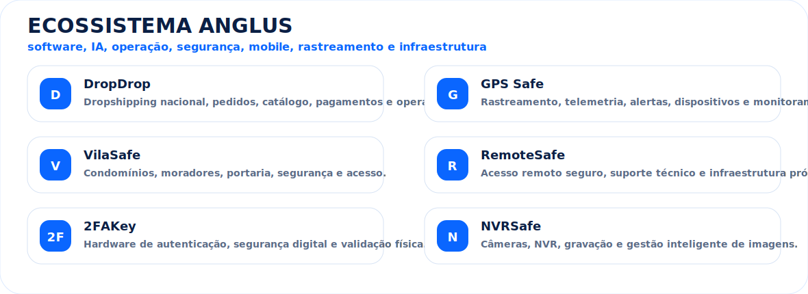
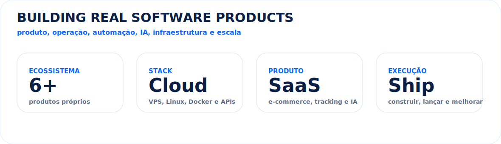

  

<h1 align="center">Michel Anglus</h1>

  <strong>Founder da Anglus Software • Full Stack Builder • SaaS • IA • Cloud • Mobile • Segurança • E-commerce • Rastreamento</strong>

  
  
  
  
  

---

## 🧠 Sobre

Sou o **Michel**, founder da **Anglus Software**, criando um ecossistema próprio de produtos digitais para **e-commerce, rastreamento, segurança, automação, IA, infraestrutura, mobile e operações empresariais**.

Meu foco é construir produtos completos: **arquitetura, backend, frontend, mobile, automações, integrações, cloud, monitoramento e operação real**.

> A Anglus Software não é apenas um perfil de código. É um ecossistema em construção.

---

## 🏢 Ecossistema Anglus

  

---

## 🧩 Stack principal

  
  
  
  
  
  
  
  
  
    
  
  
  
  
  
  
  
  
  
    
  
  
  
  
  
  
  
  
  

  
  
  
  
  
  

---

## 🚀 O que eu construo

- Plataformas SaaS completas
- Sistemas de pagamento, assinatura e pedidos
- Apps Android e iOS
- Dashboards administrativos e operacionais
- Automações com IA e agentes
- Integrações com marketplaces e APIs externas
- Sistemas de rastreamento e telemetria
- Infraestrutura Linux, Docker, VPS, AWS e Cloudflare
- Soluções para logística, segurança, atendimento e e-commerce

---

## 📊 Presença técnica

  

  

---

## 🐍 Contribution Snake

  

---

## 🎯 Visão

Construir um ecossistema de produtos próprios, conectando **software, IA, automação, infraestrutura, mobile e hardware** para resolver problemas reais de empresas brasileiras.

---

## 🌐 Contato

  

  <strong>Michel Anglus • Anglus Software</strong> 
  Tecnologia própria para operações reais.

