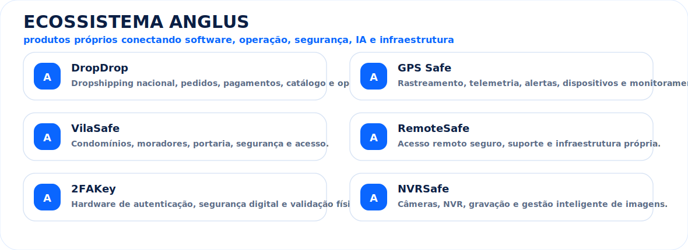
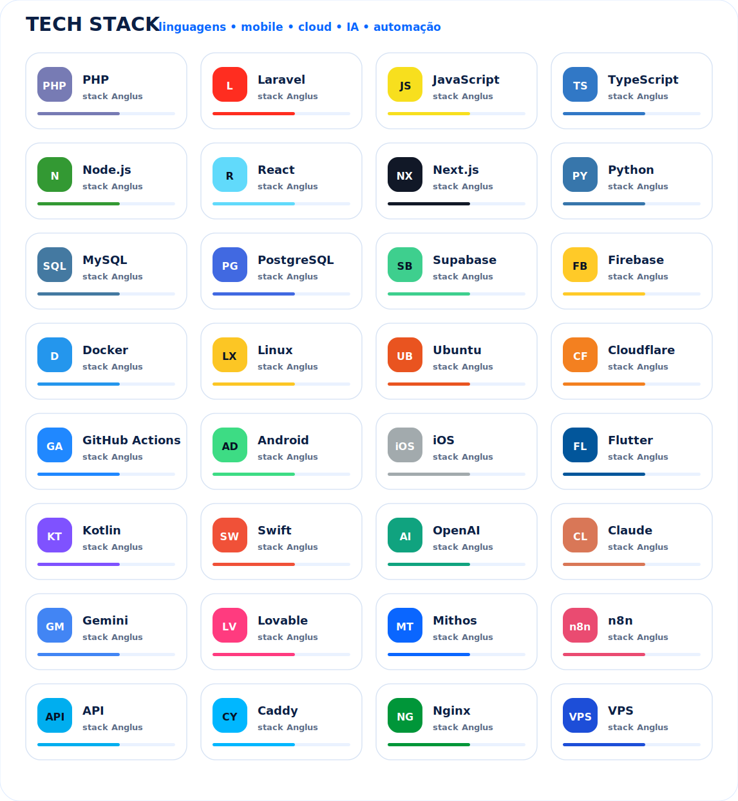
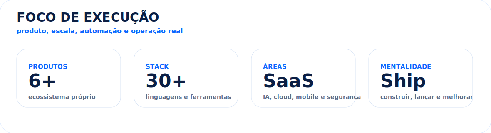

<p align="center">
  
</p>

<h1 align="center">Michel Anglus</h1>

<p align="center">
  <strong>Founder da Anglus Software • Full Stack Builder • SaaS • IA • Cloud • Mobile • Segurança • E-commerce • Rastreamento</strong>
</p>

<p align="center">
  <a href="https://anglus.com.br">
    
  </a>
  <a href="https://github.com/michel-anglus">
    
  </a>
  
  
  
</p>

---

## 🧠 Sobre

Sou o **Michel**, fundador da **Anglus Software**, criando um ecossistema próprio de produtos digitais com foco em **SaaS, IA, automação, rastreamento, segurança, infraestrutura, mobile e e-commerce**.

Construo produtos de ponta a ponta: **ideia, arquitetura, backend, frontend, mobile, integrações, automação, cloud, monitoramento e operação real**.

> Minha linha de trabalho é criar tecnologia própria, escalável e útil para empresas que precisam operar de verdade.

---

## 🏢 Ecossistema Anglus

<p align="center">
  
</p>

---

## ⚡ Áreas fortes

```txt
SaaS e plataformas web       ████████████████████  100%
E-commerce e marketplaces    ████████████████████  100%
Rastreamento e telemetria    ███████████████████   95%
IA, agentes e automação      ███████████████████   95%
Mobile Android / iOS         ██████████████████    90%
Infraestrutura Linux / Cloud ██████████████████    90%
Segurança e autenticação     █████████████████     85%
```

---

## 🧩 Linguagens, frameworks, IA e ferramentas

<p align="center">
  
</p>

<p align="center">
  
</p>

<p align="center">
  
  
  
  
  
  
</p>

---

## 🚀 O que eu construo

- Plataformas SaaS completas
- Sistemas de pedidos, pagamentos e assinaturas
- Dashboards administrativos e operacionais
- Apps mobile Android e iOS
- Integrações com APIs externas
- Automações com IA e agentes
- Aplicações com OpenAI, Claude, Gemini, Lovable e automações
- Sistemas de rastreamento e telemetria
- Monitoramento, status page e alertas
- Infraestrutura Linux, Docker, VPS e Cloudflare
- Soluções para marketplaces, logística, segurança e atendimento

---

## 📊 Presença técnica

<p align="center">
  
</p>

<p align="center">
  
  
</p>

<p align="center">
  
</p>

<p align="center">
  
</p>

<p align="center">
  
</p>

---

## 🐍 Contribution Snake

<p align="center">
  
</p>

---

## 🎯 Visão

Construir um ecossistema de produtos próprios, conectando **software, IA, automação, infraestrutura, mobile e hardware** para resolver problemas reais de empresas brasileiras.

---

## 🌐 Contato

<p align="center">
  <a href="https://anglus.com.br">
    
  </a>
</p>

<p align="center">
  <strong>Michel Anglus • Anglus Software</strong><br/>
  Tecnologia própria para operações reais.
</p>
